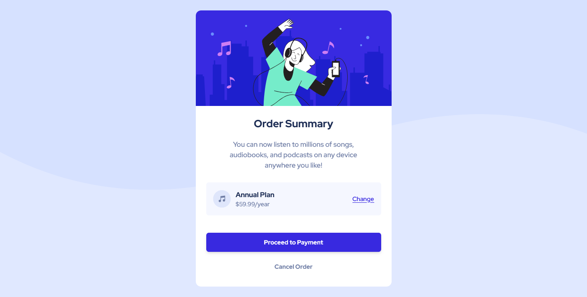

# Frontend Mentor - Order summary card solution

This is a solution to the [Order summary card challenge on Frontend Mentor](https://www.frontendmentor.io/challenges/order-summary-component-QlPmajDUj). Frontend Mentor challenges help you improve your coding skills by building realistic projects.

## Table of contents

- [Overview](#overview)
  - [The challenge](#the-challenge)
  - [Screenshot](#screenshot)
  - [Links](#links)
  - [Built with](#built-with)
  - [What I learned](#what-i-learned)
- [Author](#author)

## Overview

### The challenge

Users should be able to:

- See hover states for interactive elements

### Screenshot



### Links

- Solution URL: [github](https://github.com/oloude)

### Built with

- Semantic HTML5 markup
- Tailwind
- Flexbox
- Mobile-first workflow
- [React](https://reactjs.org/) - JS library

### What I learned

Use this section to recap over some of your major learnings while working through this project. Writing these out and providing code samples of areas you want to highlight is a great way to reinforce your own knowledge.

To see how you can add code snippets, see below:

```js
function Price() {
  return (
    <div className="flex justify-between items-center bg-veryPaleBlue py-4 rounded-md px-4 mb-10">
      <div className="flex items-center gap-3 ">
        <div className="bg-paleBlue w-10 h-10 rounded-full flex justify-center items-center">
          
        </div>
        <div className="flex flex-col ">
          <p className="text-base font-bold text-darkBlue">Annual Plan </p>
          <p className="text-sm font-medium text-desaturatedBlue">
            $59.99/year
          </p>
        </div>
      </div>
      <p className="text-sm font-medium text-brightBlue underline cursor-pointer hover:opacity-70">
        Change
      </p>
    </div>
  );
}
```

## Author

- Frontend Mentor - [@oloude](https://www.frontendmentor.io/profile/oloude)
- Twitter - [@AbosedeOloude](https://www.twitter.com/AbosedeOloude)
